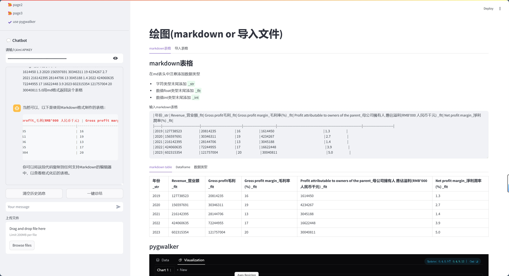
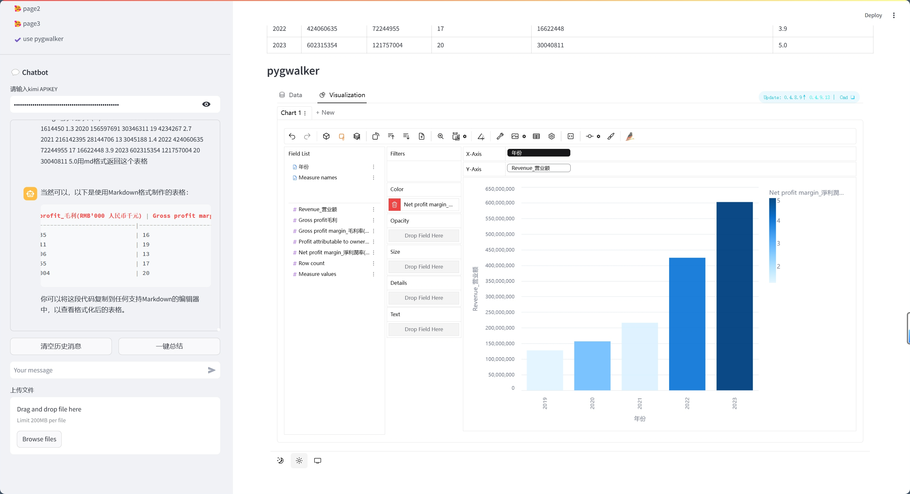
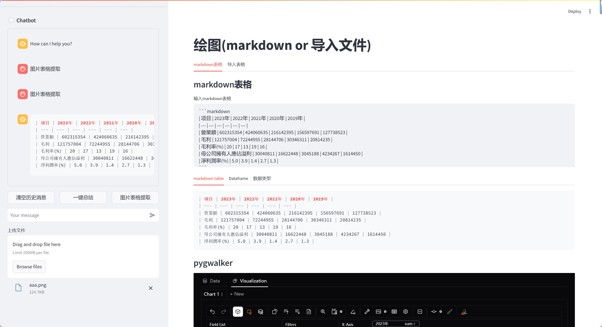
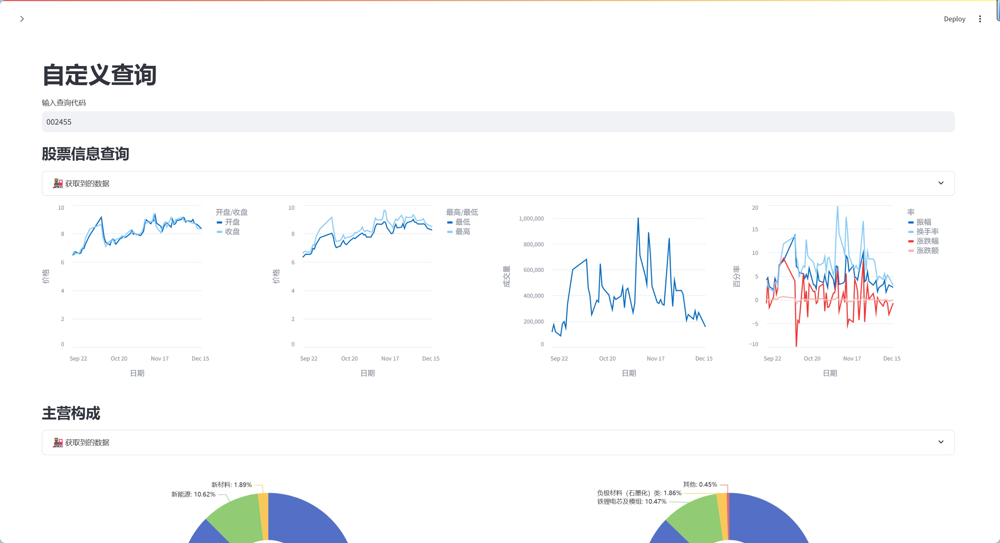
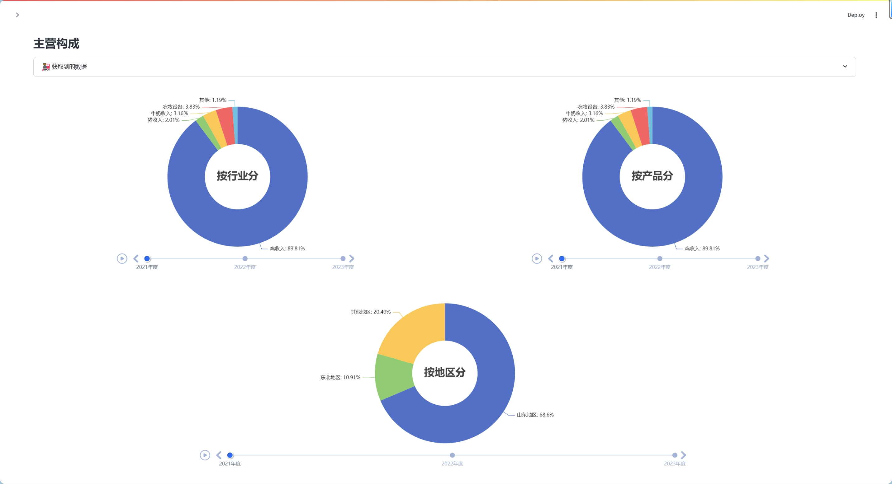
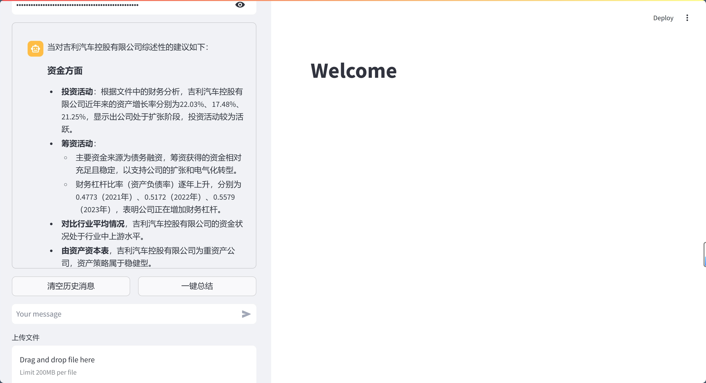
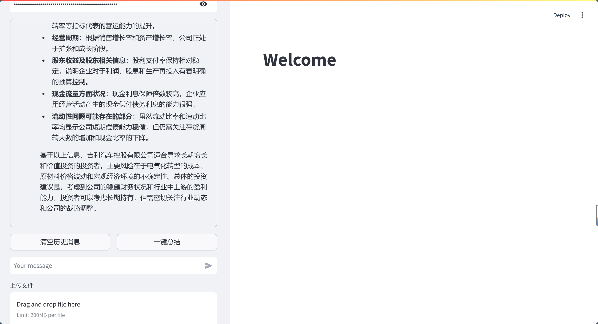

## 画图🤯
#### 上传图片

#### 结果

#### 更新：图片表格提取按钮&&自动获取数据类型&&chat回答自动填充富文本区域
| 项目 | 2023年 | 2022年 | 2021年 | 2020年 | 2019年 |
| --- | --- | --- | --- | --- | --- |
| 營業額 | 602315354 | 424060635 | 216142395 | 156597691 | 127738523 |
| 毛利 | 121757004 | 72244955 | 28144706 | 30346311 | 20814235 |
| 毛利率(%) | 20 | 17 | 13 | 19 | 16 |
| 母公司擁有人應佔溢利 | 30040811 | 16622448 | 3045188 | 4234267 | 1614450 |
| 淨利潤率(%) | 5.0 | 3.9 | 1.4 | 2.7 | 1.3 |

| 年份 | 營業額 | 毛利 | 毛利率(%) | 母公司擁有人應佔溢利 | 淨利潤率(%) |
| --- | --- | --- | --- | --- | --- |
| 2023年 | 602315354 | 121757004 | 20 | 30040811 | 5.0 |
| 2022年 | 424060635 | 72244955 | 17 | 16622448 | 3.9 |
| 2021年 | 216142395 | 28144706 | 13 | 3045188 | 1.4 |
| 2020年 | 156597691 | 30346311 | 19 | 4234267 | 2.7 |
| 2019年 | 127738523 | 20814235 | 16 | 1614450 | 1.3 |

## 自定义查询😋

## 一键总结🤓
#### 截图

